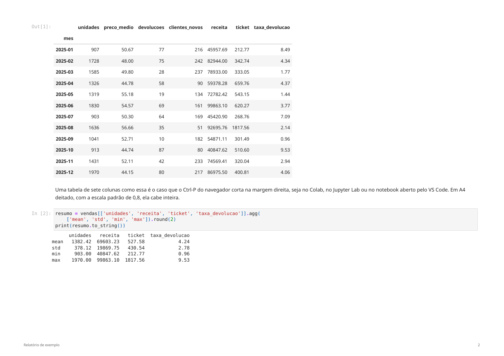

# paginar

Converte notebook Jupyter, ou HTML pronto, em PDF paginado direto do terminal,
sem LaTeX e sem depender do Ctrl-P do navegador.

## Por que

O Ctrl-P corta tabela larga na margem direita, parte figura no meio da página e
não numera folha. Vale para o Colab, para o Jupyter Lab, para o notebook aberto
no VS Code e para qualquer outro que termine no diálogo de impressão do
Chromium sem CSS de página. Exportar por LaTeX resolve, mas pede uma instalação
de TeX inteira só para isso.

O `paginar` renderiza o notebook em HTML, injeta um CSS de impressão e manda o
Chromium do Playwright imprimir. A folha sai em A4 deitado, a tabela cabe, a
figura não se parte e o rodapé traz título e número da página.

## Instalação

```sh
mkdir -p ~/.local/bin
curl -fsSLo ~/.local/bin/paginar https://raw.githubusercontent.com/FelipeArtur/paginar/main/paginar
chmod +x ~/.local/bin/paginar
```

É um arquivo só, e nada é instalado no Python do sistema. Precisa de Python 3.9
ou mais novo e de `~/.local/bin` no `PATH`.

## Uso

```sh
paginar caderno.ipynb          # PDF ao lado do notebook
paginar pasta/                 # todos os .ipynb da pasta
paginar *.ipynb                # vários de uma vez
paginar caderno.ipynb --retrato
paginar caderno.ipynb --sem-codigo   # só texto e resultados
paginar curriculo.html         # HTML pronto, impresso como está
```

O PDF sai sempre ao lado do arquivo de entrada. Para mandar em outro lugar ou
abrir o resultado, `mv` e `xdg-open` já fazem o serviço.

## Notebook e HTML seguem caminhos diferentes

Notebook é matéria-prima: é convertido, recebe o CSS de impressão, ganha margem
e sai com rodapé de título e número de página, em A4 deitado com escala 0,8.

HTML é documento acabado e entra como está, sem conversão, sem CSS injetado e
sem rodapé, porque quem escreveu já decidiu `@page`, margem e escala. O rodapé
é desenhado justamente na faixa de margem, que nesse caso pertence ao
documento, então ele cairia por cima do texto. O caso que motivou esse modo foi
um currículo de uma folha que precisa sair idêntico ao que o navegador mostra.

Pasta rende só os `.ipynb`. HTML entra quando você o nomeia, nunca por
varredura: diretório de notebook costuma ter HTML de sobra, inclusive o que o
próprio nbconvert deixa.

## Espaço em disco

As dependências (`nbconvert` e `playwright`) vão para um venv temporário que é
apagado no fim da execução, mesmo se a conversão falhar no meio. Isso custa uns
15 segundos por PDF e não deixa nada parado no disco.

A exceção é o navegador: 262 MB em `~/.cache/ms-playwright`, o cache padrão do
Playwright, compartilhado com qualquer outra ferramenta que o use. Baixar isso
a cada conversão não faria sentido. Para removê-lo quando não for mais
converter nada:

```sh
rm -rf ~/.cache/ms-playwright
```

Só o `chromium-headless-shell` é baixado, e não o pacote `chromium` completo,
que custaria 389 MB a mais sem nunca ser aberto.

Se o Python que você usa já tiver `nbconvert` e `playwright` instalados, o
`paginar` usa esse ambiente e não monta venv nenhum.

## O que ele faz com o layout

- **A4 deitado com escala 0,8.** É o que faz caber uma tabela de dez ou mais
  colunas. Em retrato, `pandas` estoura a margem e o Chromium corta o resto.
- **Não parte figura nem tabela.** Cada saída sai inteira em uma folha só, e
  título não fica órfão no pé da página.
- **Rodapé com título e número da página.** O título vem do primeiro `#` do
  notebook, não do nome do arquivo.
- **Imagens embutidas.** O PDF não depende de arquivo externo nem de rede.

## O que ele não faz

Não executa o notebook. Ele imprime as saídas que já estão salvas no `.ipynb`,
que é o que você vê ao abrir o arquivo. Se estiverem vazias ou desatualizadas,
rode antes:

```sh
jupyter nbconvert --to notebook --execute --inplace caderno.ipynb
```

A execução fica de fora de propósito: precisaria das dependências do seu
notebook (`pandas`, `scipy`, o que for), e o ambiente do `paginar` só carrega o
necessário para imprimir.

## Exemplo

`exemplo/relatorio-exemplo.ipynb` gera dados sintéticos, monta uma tabela de
sete colunas e dois gráficos.

```sh
paginar exemplo/relatorio-exemplo.ipynb
```

O resultado está versionado em
[`exemplo/relatorio-exemplo.pdf`](exemplo/relatorio-exemplo.pdf): três folhas
A4 deitadas, com rodapé e numeração. Abre antes de instalar qualquer coisa e
mostra exatamente o que a ferramenta entrega. Abaixo, a segunda página dele:



## Licença

MIT.
