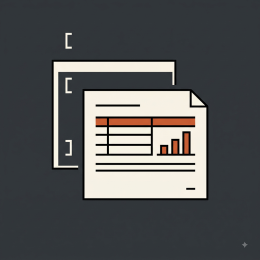
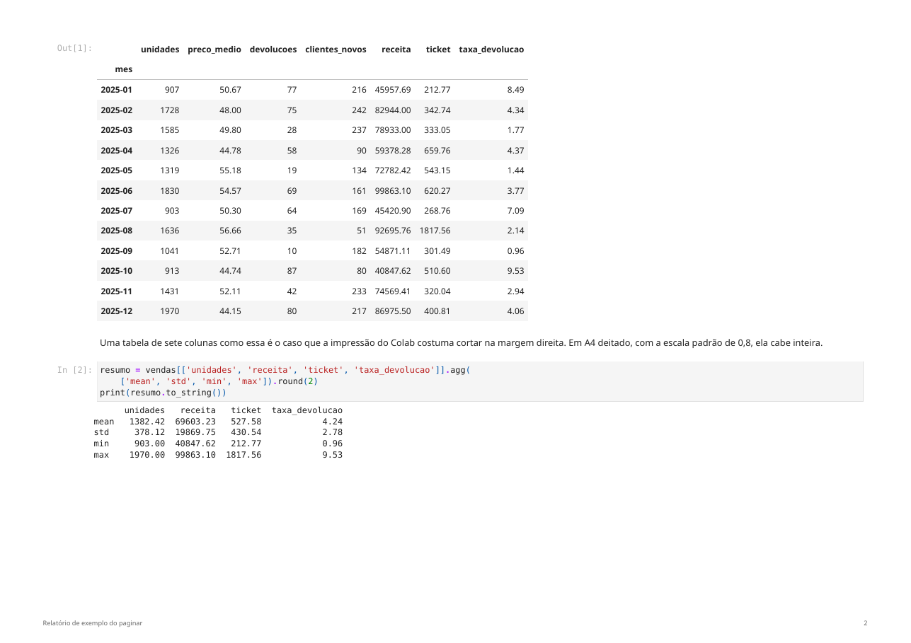

# paginar

Convert Jupyter notebooks and HTML files to paginated PDFs from the command
line, without LaTeX.

O `paginar` converte notebooks Jupyter e arquivos HTML prontos em PDFs pelo
terminal. Para notebooks, aplica o layout de impressão sem depender do Ctrl-P
do navegador.

## Por que usar `paginar`

O Ctrl-P pode cortar tabelas largas na margem direita, dividir figuras entre
páginas e deixar o PDF sem numeração. Isso acontece no Colab, no JupyterLab, no
VS Code e em outros ambientes que usam o diálogo de impressão do Chromium sem
CSS de página. Exportar por LaTeX resolve, mas exige instalar um ambiente TeX
inteiro para essa tarefa.

O `paginar` converte o notebook em HTML, aplica CSS de impressão e usa o
Chromium do Playwright para criar o PDF. A página fica em A4 paisagem, com
tabelas e figuras protegidas contra quebras e título e número no rodapé.

## Instalação

```sh
mkdir -p ~/.local/bin
curl -fsSLo ~/.local/bin/paginar https://raw.githubusercontent.com/FelipeArtur/paginar/main/paginar
chmod +x ~/.local/bin/paginar
```

É um único arquivo executável. As dependências não são instaladas no Python do
sistema. Requer Python 3.9 ou mais novo e `~/.local/bin` no `PATH`.

## Uso

```sh
paginar caderno.ipynb          # PDF ao lado do notebook
paginar pasta/                 # todos os .ipynb da pasta
paginar *.ipynb                # vários de uma vez
paginar caderno.ipynb --retrato
paginar caderno.ipynb --sem-codigo   # só texto e resultados
paginar curriculo.html         # HTML pronto, impresso como está
```

O PDF sai ao lado do arquivo de entrada. Use `mv` para movê-lo ou `xdg-open`
para abri-lo.

## Notebook e HTML seguem caminhos diferentes

O notebook é convertido em HTML, recebe o CSS de impressão e sai em A4
paisagem, com margens, escala 0,8 e rodapé com título e número da página.

Arquivos HTML entram como estão, sem conversão, CSS extra ou rodapé. O próprio
documento controla `@page`, as margens e a escala. Esse modo surgiu para
imprimir um currículo de uma página igual ao que aparece no navegador.

Pastas são varridas apenas por arquivos `.ipynb`. Para imprimir HTML, informe o
arquivo diretamente. Diretórios de notebooks costumam ter HTML incidental,
inclusive arquivos criados pelo próprio nbconvert.

## Espaço em disco

As dependências (`nbconvert` e `playwright`) ficam num venv temporário, removido
ao fim da execução mesmo se a conversão falhar. Criar esse ambiente costuma
acrescentar cerca de 15 segundos à execução.

O navegador fica no cache padrão do Playwright, em `~/.cache/ms-playwright`, e
pode ser compartilhado com outras ferramentas. O `chromium-headless-shell` usa
cerca de 262 MB. Para liberar esse espaço:

```sh
rm -rf ~/.cache/ms-playwright
```

O `paginar` baixa apenas o `chromium-headless-shell`. O pacote `chromium`
completo ocuparia mais 389 MB e não seria usado.

Se o Python selecionado já tiver `nbconvert` e `playwright`, o `paginar` usa
esse ambiente e não cria um venv.

## O que ele faz com o layout

- **A4 deitado com escala 0,8.** É o que faz caber uma tabela de dez ou mais
  colunas. Em retrato, `pandas` estoura a margem e o Chromium corta o resto.
- **Evita quebras em figuras e tabelas.** Títulos também permanecem junto ao
  conteúdo.
- **Rodapé com título e número da página.** O título vem do primeiro `#` do
  notebook, não do nome do arquivo.
- **Imagens embutidas.** O PDF não depende de arquivo externo nem de rede.

## O que ele não faz

O `paginar` não executa o notebook. Ele imprime as saídas salvas no `.ipynb`.
Se estiverem vazias ou desatualizadas, rode antes:

```sh
jupyter nbconvert --to notebook --execute --inplace caderno.ipynb
```

A execução fica de fora porque depende das bibliotecas do notebook, como
`pandas` ou `scipy`. O ambiente do `paginar` instala apenas o que precisa para
imprimir.

## Exemplo

`exemplo/relatorio-exemplo.ipynb` gera dados sintéticos, uma tabela de sete
colunas e dois gráficos.

```sh
paginar exemplo/relatorio-exemplo.ipynb
```

O PDF gerado está versionado em
[`exemplo/relatorio-exemplo.pdf`](exemplo/relatorio-exemplo.pdf): três folhas
A4 paisagem, com rodapé e numeração. Você pode abri-lo antes de instalar
qualquer coisa para ver o resultado. Abaixo está a segunda página:



## Licença

MIT.
